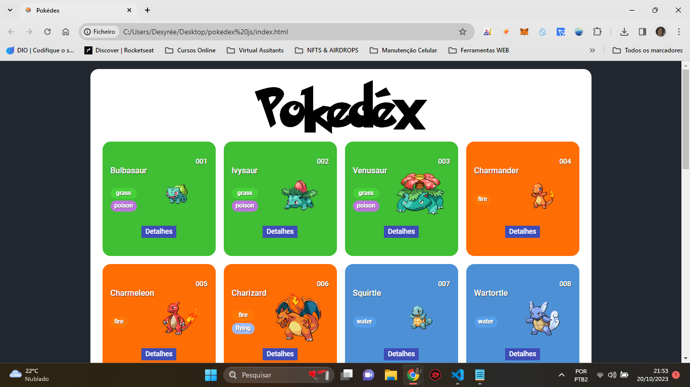

<h1 align="center">  Projeto em JavaScript: POKÉDEX </h1>

Este  projeto foi realizado como um dos desafios de aprendizado  do  programa Santander Bootcamp de 2023 -  na Formação Fullstack Java + Angular, onde deveria  criar uma página que mostrasse a primeira geração de Pokémons, utilizando a <a href="https://pokeapi.co">PokéAPI</a>. A parte principal do site foi desenvolvida concomitantemente com a aula online e a página de detalhes dos Pokemons foi desenvolvida por mim em um segundo momento.

 

    
    
Navegação no Browser Desktop

 

Use as instruções abaixo para rodar no seu computador:

<h4>Instalando o projeto:</h4>

1- `git clone https://github.com/viquiiz/pokedex.git`

2- `npm install`

3- `npm install -g http-server`

<h4>Rodando o projeto:</h4>

1- `http-server ./`

2- Acessar no browser: `http://localhost:8080`
